# Free Firm Site

## Overview

A free law firm website template built by [@digitallawyer](https://www.twitter.com/digitallawyer) using freely available software by Microsoft. **Demo: [freefirmsite.com](https://www.freefirmsite.com)**

* A complete, customizable law firm website.
* Mobile responsive and blazing fast.
* Securely served over https.
* Completely free to use.
* Easy to customize.
* Fast to deploy.

The Free Firm Site template comes with the following pages:

* A clean home page.
* A page listing the attorneys in your firm.
* A page providing an overview of your firm's services.
* An about page.
* A contact page.

## Setup

Setting up and customizing this website is easy, and requires only a minimum level of technical expertise. To do so, you will need to:

* Create a Github account (if you do not already have one)
* Make a copy of this website (also referred to as 'forking this repository')
* Customize the variables, such as the name of your law firm (by editing the `config.yml` file).
* Add information about the attorneys in your firm (by editing the `attorneys.yml` file).
* Add services your firm offers (by editing the `services.yml` file).
* Connect the website to your domain name.

The whole setup process can be performed in less than an hour. Because hosting on Github pages is free, the only cost involved is the annual renewal fee of the domain name you choose. The end-result is a professional law firm website that is blazing-fast, works on desktop and mobile, and is incredibly cost-effective.

### 1. Create a github account

First, you will need to **create a Github account**. Github is owned by Microsoft and is used by developers to store and track changes to software code. Think about it as track changes but for software code. If you already have a Github account, you can skip this step. If you do not yet have a Github account, go to [github.com](https://www.github.com) to get started.

### 2. Make a copy of this website

Once you have created and are logged in to your github account, you can make a copy of the demo website. To do so, go to [https://github.com/digitallawyer/freefirmsite](https://github.com/digitallawyer/freefirmsite) and click the "**Fork**" button located at the top right of the page. By "Forking" a repository, you are making a copy of the original website, in your Github account. 

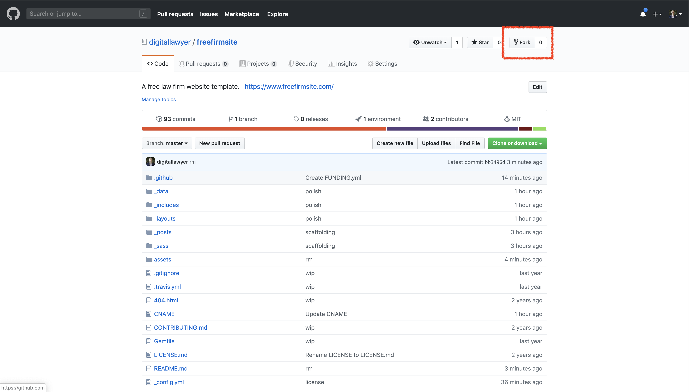

### 3. See it in action

Congrats! You now have your own, personal copy of the Free Firm Site repository. Github allows you to host your website, for free, on Github Pages. To do so, click the "**Settings**"" button on your repository page.

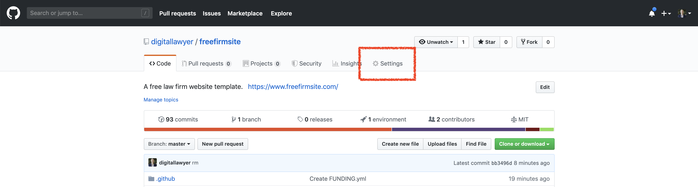

Scroll down until you see the **Github Pages** section. Click on the "Source" button and select "master branch". This tells Github that you would like to use Github Pages, and that Github Pages should show your visitors the code in the main branch of your repository.

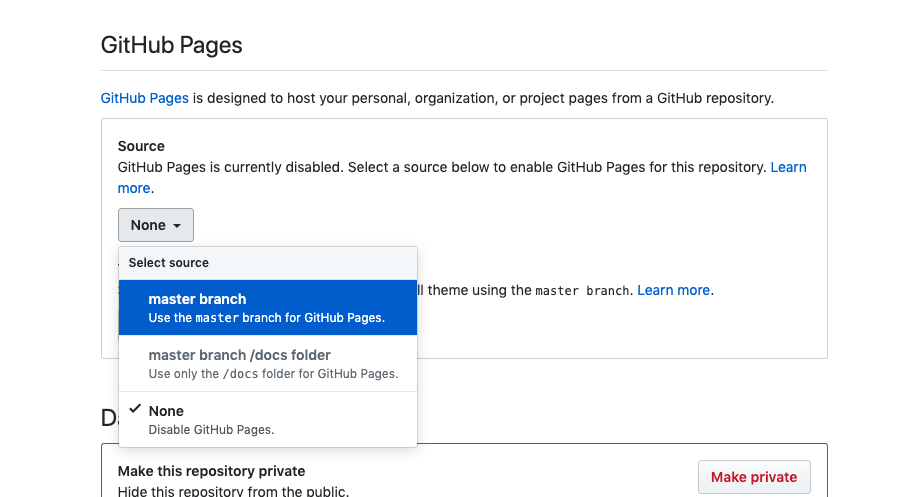

As soon as you enable Github pages, your website will start building, and Github will make it available online. The settings page will show the url at which the site is available, and you should be able to visit your website moments later. You too are now a digital lawyer.

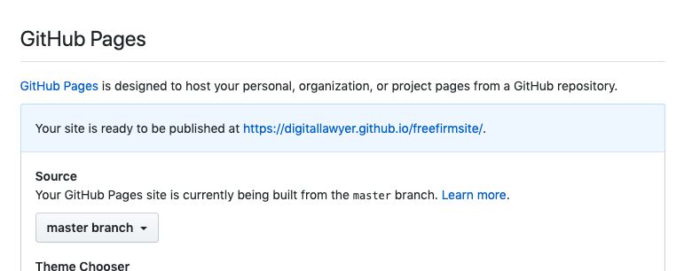

### 4. Customize the variables

Time to start customizing your website! There are various ways to achieve this, but to keep things simple, we'll work from the Github interface. This allows you to complete the setup of your website without having to install any software.

The key variables for your website are contained in a file called `config.yml`. To edit this file, go to your repository and click on `config.yml`.

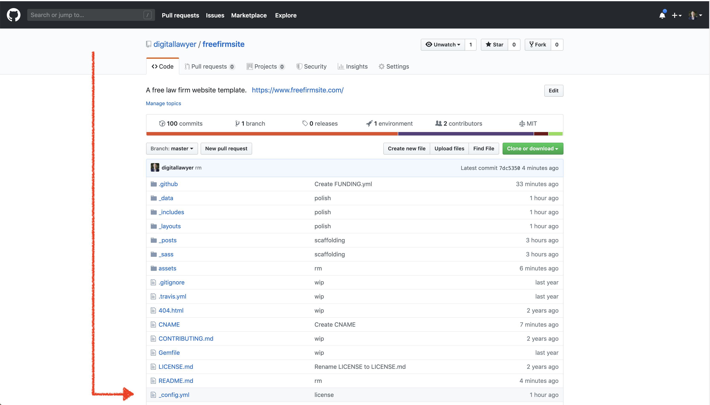

Editing `config.yml` will change the variables of your website. To edit `config.yml`, click the edit button (the pen icon) on top of the page.

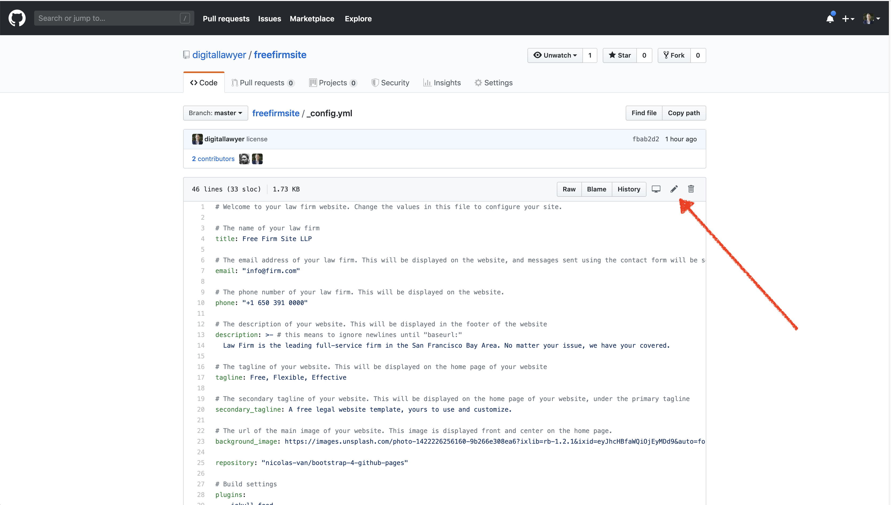

Each item in the `config.yml` comes with a little description. Change the values to your liking, scroll down, and click "Commit Changes". Your website will automatically update in a matter of minutes.

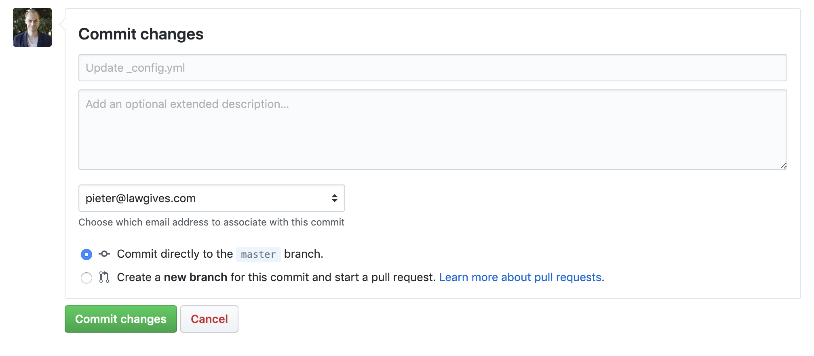

### 5. Add information about the attorneys in your firm

Once you have configured the basics of your website, you can modify the information about the attorneys in your firm. To do so, go to your repository and click on the `_data` folder. Then click `attorneys.yml` and edit the file by clicking the edit button (the pen icon).

Update the `name`, `bio`, `email`, and `phone` fields with the correct info for each attorney in the firm. Save by pressing the commit button. Your website will rebuild, and be updated in a matter of minutes. Delete or add attorneys as necessary.

In order to show pictures for the attorneys in your firm, set the `picture` value to the name of your picture, and upload the picture to the `assets/images folder. You can upload pictures by clicking the "Upload Files" button in the `assets/images folder.

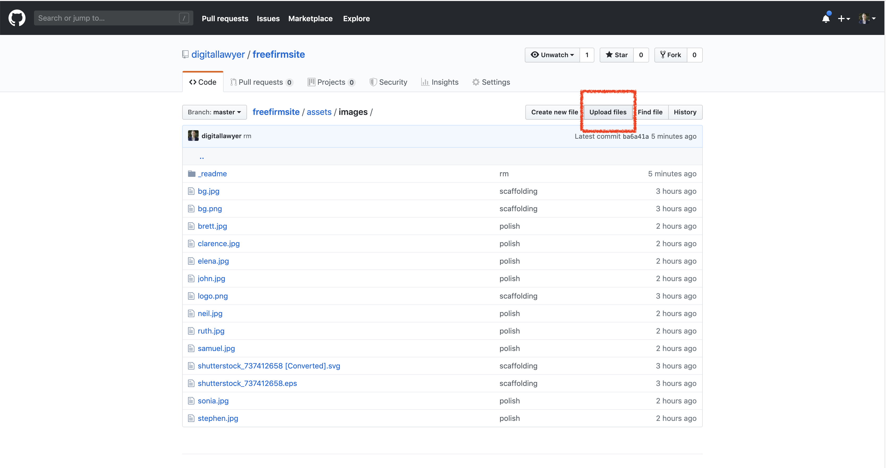

### 6. Add services your firm offers

Editing the services your website offers follows a similar process. Go to your repository and click on the `_data` folder. Then click `services.yml` and edit the file by clicking the edit button (the pen icon). You can add as many services as you like. The end result should look like this:

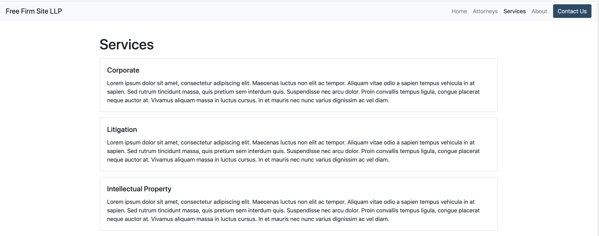

### 7. Customize the about page

Almost done! To edit the about page and tell potential clients about your firm, go to your repository and visit `about.md`. You might recognize the content of this file: it contains the instructions you are currently reading! Simply replace the text and hit commit. Your new about page will become available shortly thereafter.

### 8. Connect the website to your domain name

Finally, you will connect the website to your custom domain name. To do so, you must first register a domain name and change the dns settings with your domain name registrar to point to Github Pages. To do so, follow the instructions provided by your domain name registrar. For example, the settings for freefirmsite.com look like this: 

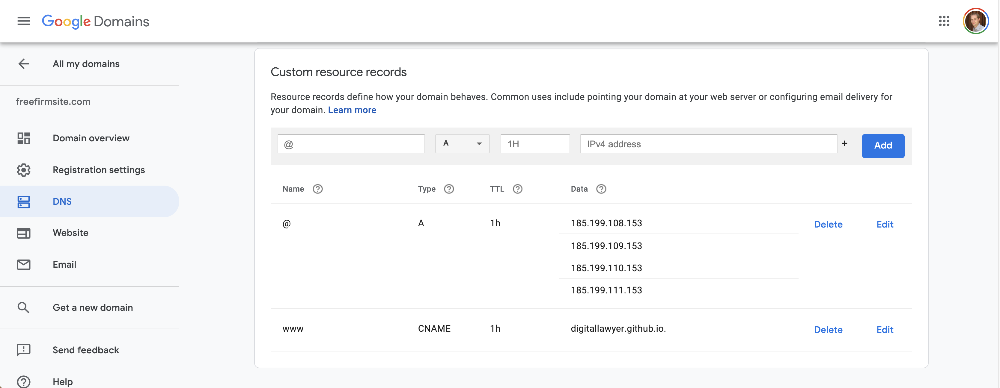

Once you have updated your DNS settings, go to your github repository and click on **settings**. Scroll down to the Github pages section, add your custom domain name in the corresponding input field, and hit save.

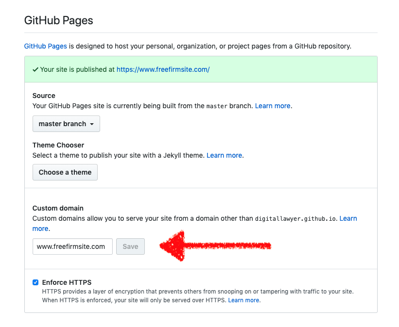

### 9. Enable https

Once you save your custom domain name, Github will issue a security certificate. After a couple of minutes, you will be able to enable https. This ensures that all traffic to your website is encrypted. To enable https, go to your github repository and click on **settings**. Scroll down to the Github pages section, and select the **enforce HTTPS** option. 

It typically takes a while for the https certificate to become valid. To speed up the process, delete your custom domain name after you have enabled https, and subsequently add it again.

### 10. Setting up the contact form

The contact form on your website uses Formspree, a free, easy to use solution for contact forms. Make sure you have correctly set the `email` value in `config.yml`. On your custom domain, click **Contact** and submit the form. You will see a warning page asking you to activate the form. Check the inbox of the email address you added in `config.yml` and verify. New form submissions will now arrive on the email address you provided.

## License

This project is licensed under the MIT License.
